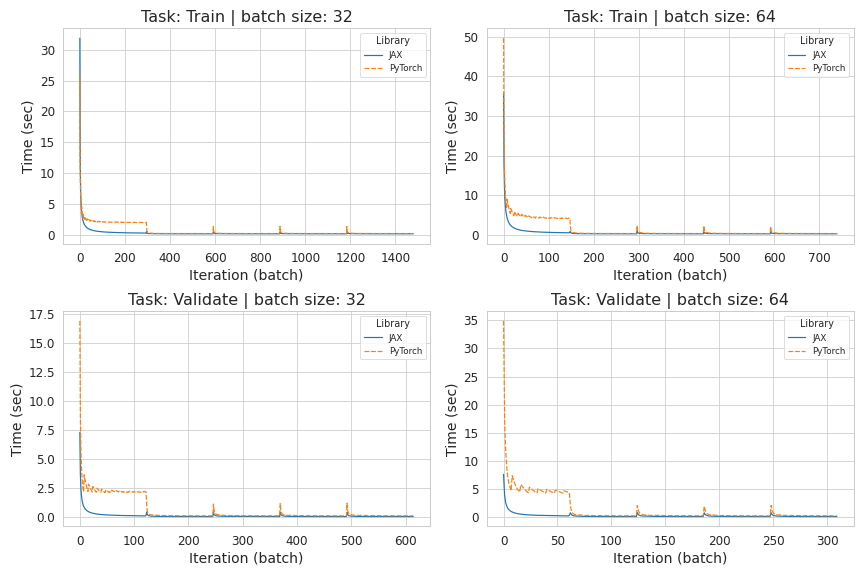
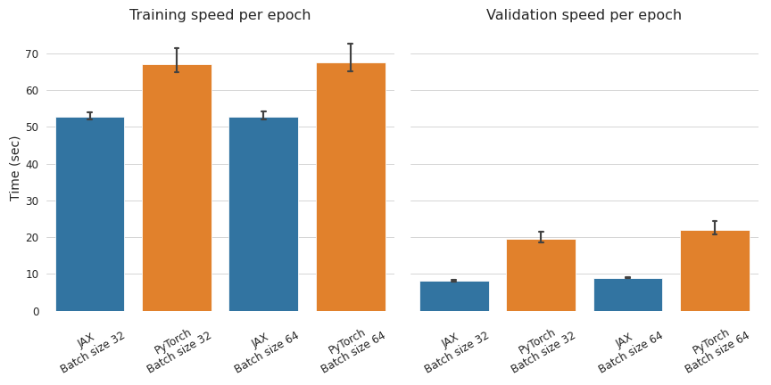

# JAX implementation of Swin-Transformer v2

## Introduction
This project compared the performance (training/validation speed and accuracy for sanity checking) of Swin-Transformer v2 implemented in JAX and PyTorch. All of these works had been done in Colab environment with Tesla V100-SMX2 GPU. Some of the features in Swin-Transformer v2 has not been implemented, or omitted, yet in JAX setting, such as absolute positional embedding or using pretrained window.

## Getting Started
### Installation
Since this project was done in the Colab environment, which pre-installed all the DL related packages ([PyTorch](https://pytorch.org/get-started/locally/), [JAX](https://github.com/google/jax#installation), [Tensorflow](https://www.tensorflow.org/install)), instructions for installing those packages are omitted. If you are not using the Colab, please visit the links above to install those packages.

All the remaining packages can be installed with the following command:
```shell
pip install -r requirements.txt
```

### Download Imagenette dataset
This project used [Imagenette](https://s3.amazonaws.com/fast-ai-imageclas/imagenette2.tgz) dataset. Imagenette dataset is a subset of 10 classes from Imagenet (tench, English springer, cassette player, chain saw, church, French horn, garbage truck, gas pump, golf ball, parachute). If you want to train/test yourself, please click "Imagenette" above to download the dataset. 

Its file size is 1.45 GB, and contains 9,469 training images and 3,925 validation images.

### Train Swin-Transformer v2 (PyTorch/JAX)


## Experiment & results
With image size=(256,256) and batch size 32 and 64 settings, both the JAX and the PyTorch took significantly longer during the first epoch, especially during the first iteration (batch). I assume this was caused by GPU memory allocation during the first run. However PyTorch took longer than even after the first iteration, and the speed became faster when the second epoch started. 


Including the first epoch, with batch size = 32 and 64, JAX was 27.3% and 28.0% faster than PyTorch respectively during training. Also, JAX was 140.5% and 147.4% faster than PyTorch respectively during validation.


Without the first epoch, the speed differences were reduced to 24.9% during training for both batch sizes, and 132.1% and 137.7% respectively during validation with batch size 32 and 64.

## Discussion
- Factors caused the bottleneck
- Checkpoints remain in Trash folder

## TODO
- requirements.txt update
- Different task
- Analyze time consumption step-by-step

## Acknowledgements
This project was inspired by [Swin-Transformer](https://github.com/microsoft/Swin-Transformer) and [vision_transformer](https://github.com/google-research/vision_transformer). Some of the codes were borrowed from them.