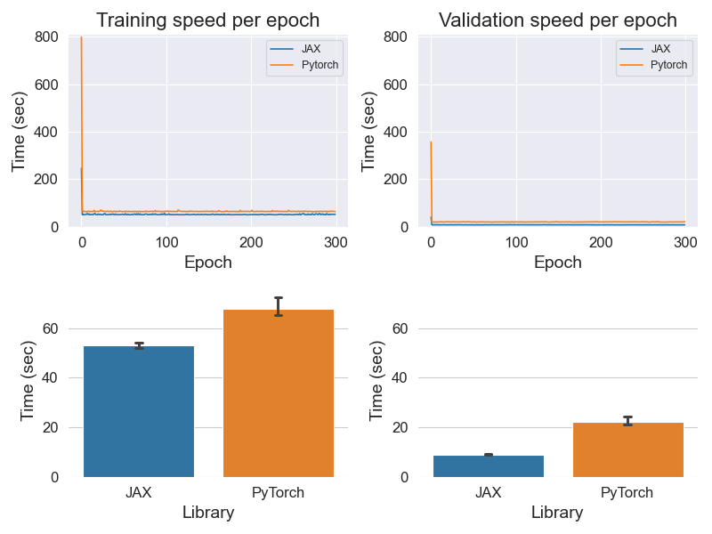

# JAX implementation of Swin-Transformer v2

## Introduction
This project compared the performance (training/validation speed and accuracy for sanity checking) of Swin-Transformer v2 implemented in JAX and PyTorch. All of these works had been done in Colab environment with Tesla V100-SMX2 GPU. Some of the features in Swin-Transformer v2 has not been implemented, or omitted, yet in JAX setting, such as absolute positional embedding or using pretrained window.

## Getting Started
### Installation
Since this project was done in the Colab environment, which pre-installed all the DL related packages ([PyTorch](https://pytorch.org/get-started/locally/), [JAX](https://github.com/google/jax#installation), [Tensorflow](https://www.tensorflow.org/install)), instructions for installing those packages are omitted. If you are not using the Colab, please visit the links above to install those packages.

All remaining packages can be installed with the following command:
```shell
pip install -r requirements.txt
```

### Download Imagenette dataset
### Train Swin-Transformer v2 (PyTorch/JAX)


## Experiment & results
With batch size=64 and image size=(256,256) settings, JAX was 21.9% faster than PyTorch during training and 59.6% faster during validation.



## Discussion

## TODO


## Acknowledgements
This project was inspired by [Swin-Transformer](https://github.com/microsoft/Swin-Transformer) and [vision_transformer](https://github.com/google-research/vision_transformer). Some of the codes were borrowed from them.